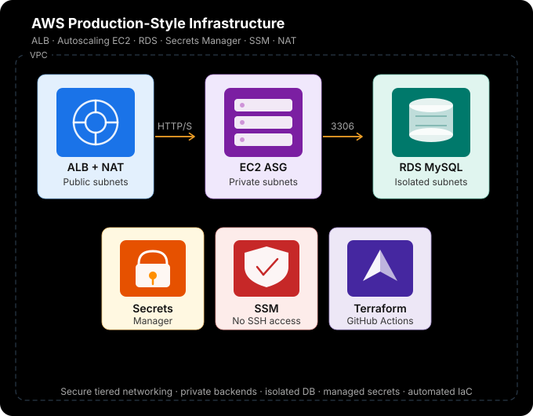

# Server Based AWS - Three Tier Web Application Architecture – Terraform project.

## Author:
Network-minded Cloud Engineer inspired on his journey by the philosophy of 'discipline equals freedom' and 'the only easy day was yesterday'.
Specializing in event-driven architectures, Python automation and Terraform for consistent, modular deployments. 
I bridge the gap between traditional networking and modern cloud automation.

## About:
This project a clear three-tier web application architecture built on AWS using Terraform. Can be called a classic these days but it thaught me a lot.
It demonstrates how to structure and deploy a web application in the cloud. The architecture is designed to be scalable, secure, and highly available, following industry best practices.
CICD pipeline, with manual approval step, is included to automate the deployment process and ensure that changes are reviewed before being applied to production.

## Use cases:

Web Application Hosting: This architecture is ideal for hosting a web application that requires a front-end interface, a back-end application layer, and a database for data storage.

E-commerce Platform: An online store can use this architecture to manage product listings, handle customer interactions, and store transaction data securely.

Content Management System: A CMS can leverage this architecture to serve web pages, manage content, and store user data efficiently.

Any other online service that requires a structured approach to application deployment can benefit from this architecture.

## Resource graph:

## How it works:
1. The user accesses the web application through the Application Load Balancer (ALB).
2. The ALB routes incoming traffic to the appropriate EC2 instances in the Auto Scaling Group (ASG) based on the defined routing rules.
3. The EC2 instances in the ASG run the application code and handle user requests.
4. The application on the EC2 instances interacts with the RDS database to store and retrieve data as needed.
5. The ASG automatically scales the number of EC2 instances based on the defined scaling policies to handle varying levels of traffic.
6. The CICD pipeline automates the deployment process, allowing for continuous integration and delivery of application updates. 
   The manual approval step ensures that changes are reviewed before being applied to production.
7. The architecture is designed to be highly available, with the ALB distributing traffic across multiple EC2 instances and the RDS database configured for multi-AZ deployment.

## How to deploy:

To deploy this architecture in your own AWS environment:

1. Clone the Repo: Open your terminal and clone this repository to your local machine.

2. Configure Credentials: Ensure your AWS CLI is installed and configured with the necessary permissions.

3. Update the region to match yours, adjust the EC2 and RDS instance types to match your project requirements.

4. Please bear in mind that the Secret Manager secret is set to have a recovery window of 0 days. 
   This means that if you delete the secret, it will be permanently deleted immediately.
   Be cautious when managing secrets in this configuration, as there will be no option for recovery once a secret is deleted.

5. Initialize & Deploy:

* Run terraform init to download the providers.
* Run terraform plan to review the changes.
* Run terraform apply to deploy the infrastructure.

6. Access the Application: Once the deployment is complete. 
   You can access the web application through the ALB's DNS name, which will be outputted by Terraform.

7. You can upload the project to your GitHub repo to take advantage of the CICD pipeline for future updates and deployments. 
   Remember to set up the necessary permissions and configurations for the pipeline to function correctly.